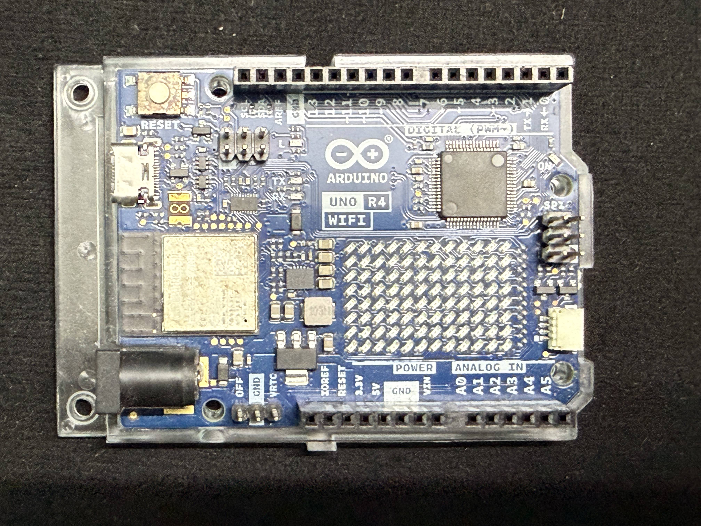
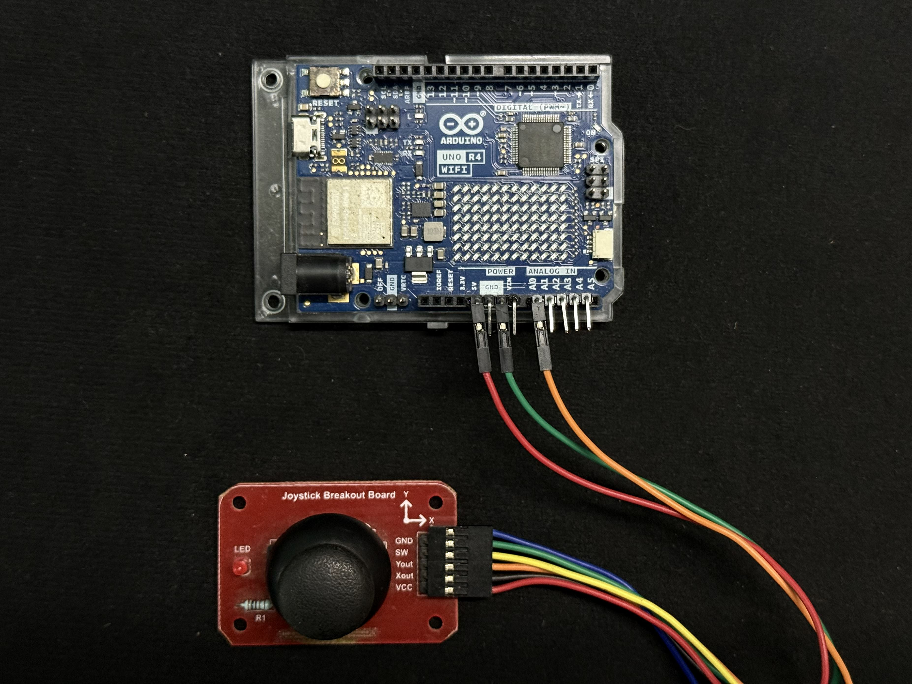

# 🎮 Pong on Arduino Uno R4 WiFi  
### A Classic Game Rebuilt with a Joystick and a 12×8 LED Matrix

> *A retro game implemented entirely on the Arduino Uno R4 WiFi using its built-in LED matrix and a joystick.*

---

## Introduction

With the release of the **Arduino Uno R4 WiFi**, Arduino introduced a powerful new microcontroller along with a surprisingly fun feature: a built-in **12×8 LED matrix**. While small and monochrome, this display is perfectly suited for retro-style games—especially **Pong**, one of the earliest video games ever created.

In this project, I built a **fully playable Pong game** using:

- Arduino Uno R4 WiFi  
- On-board 12×8 LED matrix  
- Joystick module for paddle control  

The result is a smooth, responsive, and surprisingly addictive micro-game that runs entirely on the board itself.

---

## Why Pong?

Pong may look simple, but it’s a fantastic embedded-systems challenge. It forces you to think carefully about:

- Real-time input (joystick → paddle)  
- Frame timing and animation  
- Collision detection  
- Game state management  
- Display constraints (only **96 pixels!**)  

On a 12×8 matrix, every pixel matters. There’s no room for waste, which makes Pong a perfect test of clean logic and thoughtful design.

---

## Hardware Used

The hardware setup is intentionally minimal:

- Arduino Uno R4 WiFi  
- Joystick module  
- USB cable for power and programming  

### Wiring

The wiring is very simple—just a direct connection between the Arduino and the joystick.

| Arduino | Joystick Pin |
|-------|--------------|
| 5V    | VCC          |
| GND   | GND          |
| A0    | Yout         |

Only one axis is required, making the joystick behave like a potentiometer but with a much better tactile feel.

---

